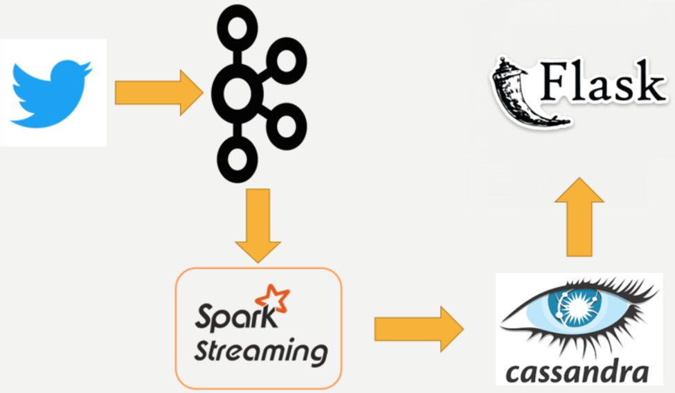
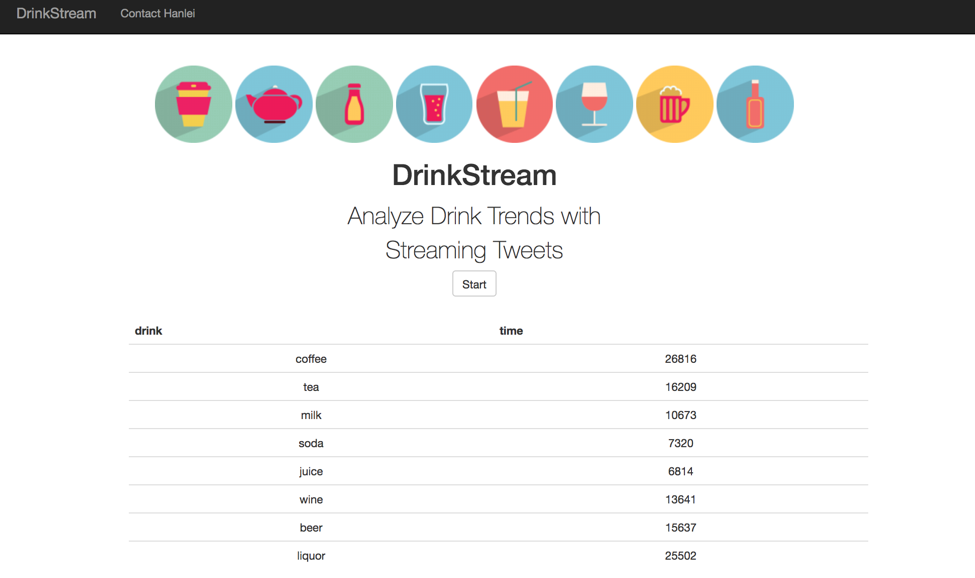

# DrinkStream
Analyze drink trends based on streaming twitter data.

## Technologies:
Twitter API, Kafka, Spark, Cassandra, Flask

## Description
This is a project developed by Hanlei Wang during September 2017 at Insight Data Science, Palo Alto, CA. 
It is basically a complete end-to-end data pipeline that catch real-time steaming data, do ETL and basic analytical work, and finally present some insights about drink trends to users. 
You can have an overview about DrinkStream from following links:

DrinkStream URL: 		      [Drink Stream App](https://www.anadrink.club)  
Demo slides: 			        [Drink Stream Demo Slides](https://www.goo.gl/G95TW1)  
Demo script for slides: 	[Drink Stream Demo Script](https://goo.gl/EPC8RK)  

## Pipeline

## Set Up
1. Pegasus, a VM-based deployment tool published by Insight Data Science, is used to deploy the three clusters (Kafka, Spark, and Cassandra) used in this project. All the necessary scripts can be found in the *deployment* directory. Note that an AWS account and PEM key are necessary to deploy clusters via this method. The PEM key should accessible on your machine as *~/.ssh/key-pair.pem*. You should have your AWS set up before trying to set up this pipeline. Also, **MAKE SRUE YOUR SECURITY GROUP IS NOT INBUND ACCESSIBLE TO ALL AS 0.0.0.0./::0**. It is highly possible that your AWS clusters will be hacked if your clusters are accessible from any IP address. Only open the port and customer addresses you want. Please check *README.md* in *deployment* for more information about Pegasus and cluster set up.

2. In order to get real-time Twitter data from Twitter streaming API, you have to sign up a twitter developer account at [https://apps.twitter.com](https://apps.twitter.com) and follow the instruction there to get your four parameters: access key, access secret key, consumer key, and consumer secret key. I called my Twitter App as *InsightDE_twitter*. Please change it to anything you like, as long as you get your keys filled in *producer.py* under *kafka* folder.

3. Change the KafkaProducer bootstrap_server IP address in *producer.py* to your AWS cluster public IP address in order to make Kafka producer work. Once you finish changing parameters in kafka producer, you can run it by `python producer.py` under that the path you stored your producer.py file.

4. Once your producer is running, you can start to run consumer.py in ‘spark’ folder. Before submit it to sparking processing, please change the public DNS address of your Cassandra cluster and brokers public DNS address. Than you can submit it and run a spark streaming process as the consumer of kafka. 
For example, `spark-submit consumer.py` in the same path where you store consumer.py
Note that if executing Spark scripts manually, *spark_assign_release_scores.py* must be executed prior to *spark_assign_user_scores.py* in order for release scores to propagate to the users table for ranking purposes.

5. You may need to install some packages to run both producer and consumer here in the pipeline. Simple import the missing packages like following.
`sudo pip install package_name_here` or `sudo apt-get package_name_here`
One except is that you have to download *spark-streaming-kafka-0-8-assembly_2.11.jar* and put it into */usr/local/spark/js* in your AWS master cluster in order to connect kafka with spark. Please go to the link below to download the jar. 

6. For the frontend UI set up, please refer to the link below and have some overview about Flask. 
[Flask Set Up Instruction](https://github.com/InsightDataScience/data-engineering-ecosystem/wiki/Flask)

Replace the *index.html* with *drink.html* and add *drink.js* to the */flask/static/js* folder will make most of the work done. 

## Testing and Monitoring
You can use Pegasus to set up Kafka-manager(port 9001) and have a real-time administration over the Kafka clusters. Also, you can try add more topics catch from Twitter Streaming API to test the actual throughput of this pipeline. Please use AWS monitoring to have a detailed view about actual data flow and CPU calculating work done in the AWS clusters. For Hadoop (you have to install Hadoop to run Spark), port 50070 as HDFS dashboard, port 8088 as Job Tracker, port 19888 as Job History list. For Spark, port 8080 as Cluster UI, port 4040 as Job UI, port 8888 as Jupyter Notebook where you can access all your files in the cluster. 

## Result
The pipeline in this project is relatively simple, which was purposely designed this way to help understanding how each technology related with each other. Also, the efficiency of the pipeline also is a highlight. Sometimes, simple is the best. I post two screenshot of the UI here as a detailed view about the final analytical result of the project. The list provides the specific numerical value about how many tweets were created about the drink. The pie chart gives the estimated market share based on the number of how many tweets were created historically. Finally, the line chart shows the real-time trend of each beverage category and the popularity of them. 

